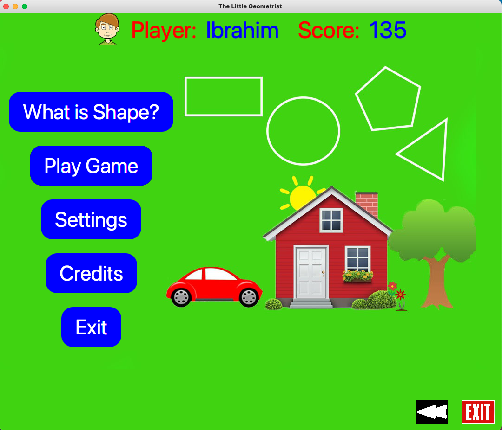
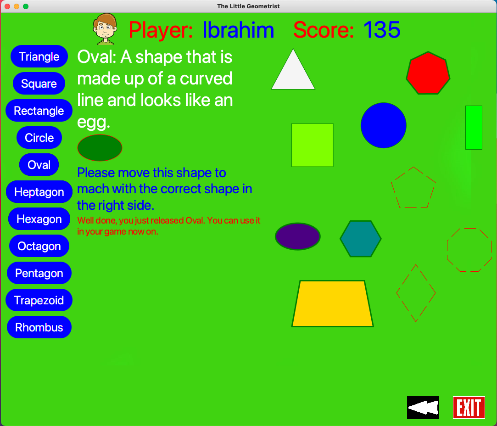
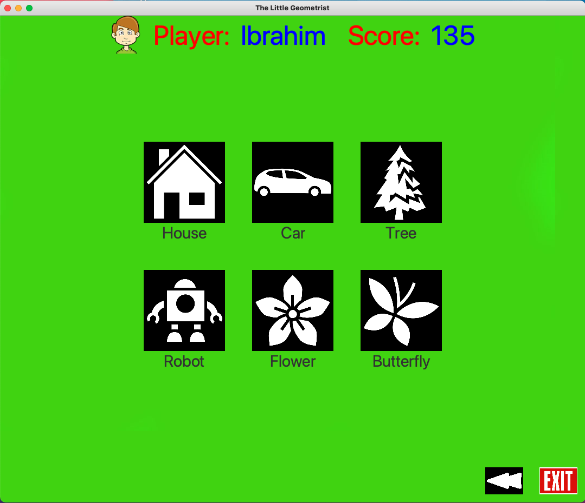
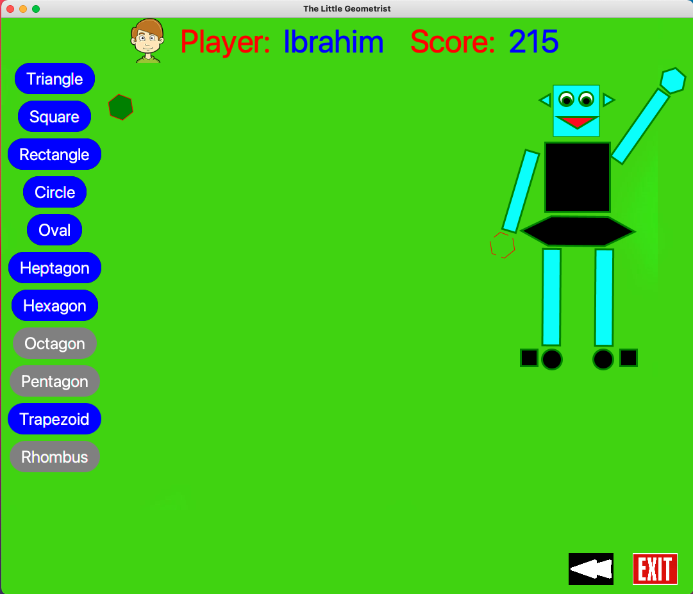
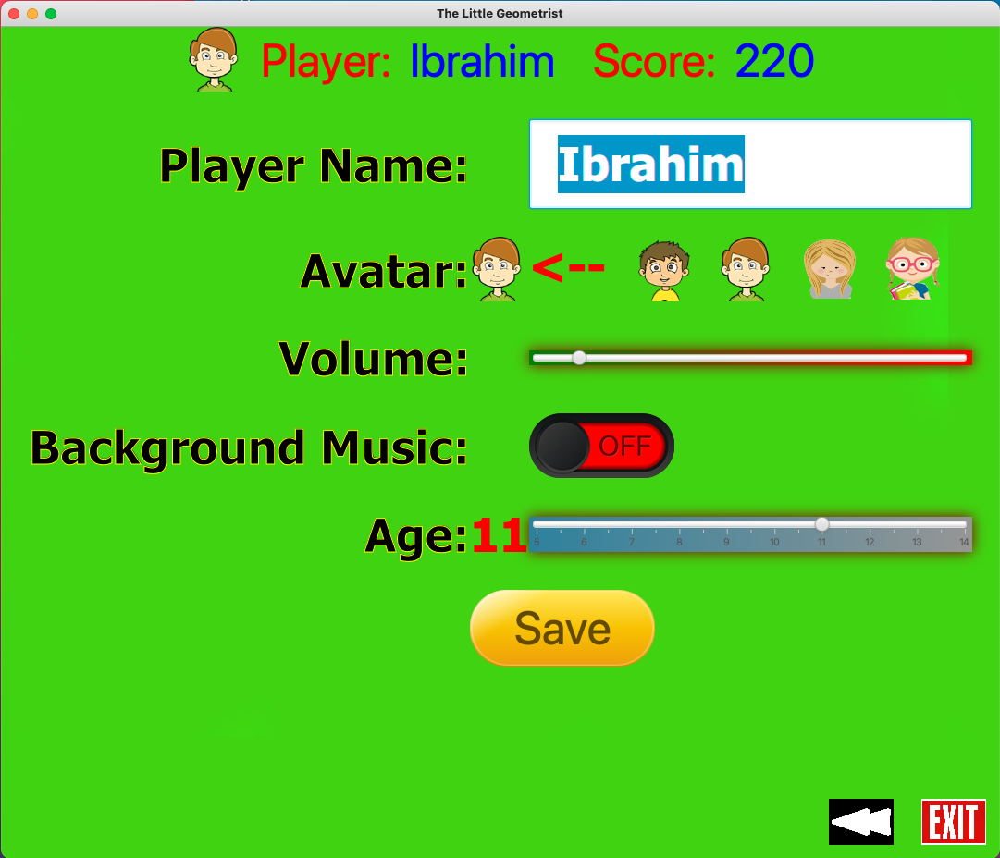
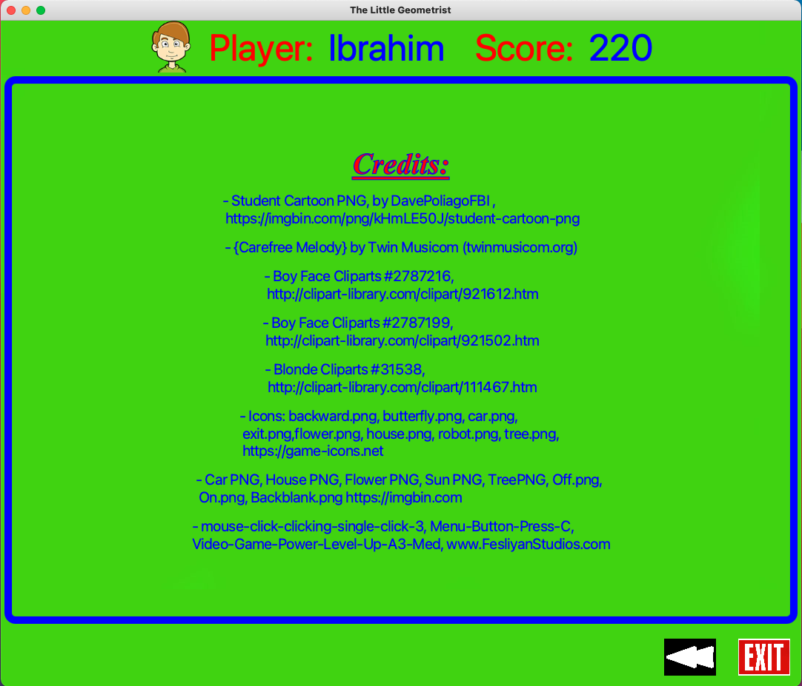

# The Little Geometry

## Author:
### Name: Ibrahim (Wusiman Yibulayin)
### Student ID: 0728356

## Table of Content
- [Description](#description)
- [Getting Started](#getting-Started)
- [Screen Shots](#screen-shots)

## Description
This game is designed to educate elementary school students about geometric figures.
The player can learn about shapes. After learned a shape, the player can play the game 
by matching that shape into a picture.

## Getting Started
The Little Geometry is a game developed with JavaFX. It includes two major parts: learn and play
In learn section, students can learn different shapes by their description and can prove their 
knowledge by matching the shape into exact shape in the shape groups. In play section, students 
can select different items and fill the blank shapes into the item. Only learned shapes can be 
placed into the picture of an item.

## Screen Shots
### Main Screen

### Learn Shapes Screen

### Select Item Screen

### Play Screen

### Settings Screen

### Credits Screen
